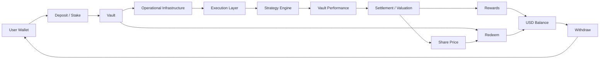

## Overview

RondoSync is designed to route user capital into Vault-based strategies through a structured lifecycle.

The flow may differ depending on the selected Vault, supported network, strategy, accounting rules, and platform conditions.

<Info>
RondoSync separates **Deposit**, **Redeem**, and **Withdraw**. A user may deposit into a Vault, redeem a Vault position according to Vault rules, and withdraw available **USD Balance** to a connected wallet.
</Info>

---

## Step 1 — Connect Wallet

Users connect their wallet to access the platform.

- No traditional account or password is required
- The wallet address acts as the user identity
- Supported interactions may require cryptographic signatures
- Users are responsible for protecting their wallet and private keys

Wallet connection does not guarantee eligibility for all Vaults, networks, or platform features.

---

## Step 2 — Deposit into Vault

Users **deposit** supported assets into a selected Vault. In the app, this action may appear as **Stake**.

A deposit may:

- Be initiated from the user’s connected wallet
- Be executed through smart contracts
- Be recorded on-chain where applicable
- Be allocated to a specific Vault
- Be converted into **Shares** according to the applicable **Share Price** and Vault rules

Each Vault may define its own parameters, including:

- Supported assets
- Supported networks
- Minimum deposit amount
- Duration or lock-up period
- Fee structure
- Strategy profile
- Redeem conditions
- Reward treatment

Depositing into a Vault does not mean the funds are immediately available for wallet withdrawal. Deposited funds become part of the selected Vault position.

---

## Supported Networks

Both **Deposit** and **Withdraw** may be supported on selected networks.

| Network | Status | Notes |
| --- | --- | --- |
| BNB Chain | ✅ Live | Fully supported |
| Ethereum | 🔄 In Progress | Integration in progress |
| Arbitrum | 🔄 In Progress | Integration in progress |
| Polygon | 🔲 Planned | Under consideration |
| Base | 🔲 Planned | Under consideration |
| Optimism | 🔲 Planned | Under consideration |

Support for additional EVM-compatible chains may be added over time.

<Info>
Network support may differ by feature, Vault, asset, and operational status. Users should always confirm the correct network before submitting any transaction.
</Info>

---

## Step 3 — Capital Routing

Deposited funds may be routed through operational infrastructure for execution.

- Movement may be governed by controlled wallet infrastructure
- Policy-based transaction controls may apply
- Routing may depend on Vault strategy, network, liquidity, and operational requirements
- Internal controls may be applied before funds are deployed

The exact routing process may differ depending on the Vault and execution setup.

---

## Step 4 — Policy and Security Controls

Capital movement may be subject to policy and security controls.

Controls may include:

- Whitelisted destination addresses
- Transaction limits
- Approval flows
- Risk-based restrictions
- Monitoring and anomaly detection
- Security or compliance review where applicable

These controls are designed to reduce operational risk and protect the integrity of the fund flow.

---

## Step 5 — Strategy Execution

Capital may be deployed through strategy execution infrastructure.

Execution environments may include:

- Centralized platforms
- Decentralized protocols
- Liquidity venues
- Market-making environments
- Other approved execution infrastructure

Strategies may include:

- Market-neutral approaches
- Liquidity provision
- Structured yield strategies
- Other Vault-specific strategies

Execution may adapt to market conditions, liquidity, risk limits, and operational requirements.

<Info>
The underlying strategy logic may not be publicly disclosed. Users should evaluate Vault-level information, risk disclosures, and applicable terms before participating.
</Info>

---

## Step 6 — Vault Performance

Vault performance may be positive or negative.

Performance may depend on:

- Market conditions
- Strategy performance
- Execution efficiency
- Liquidity conditions
- Fees and costs
- Third-party venue performance
- Operational factors
- Vault-specific accounting rules

Performance is not fixed, stable, or guaranteed.

---

## Step 7 — Settlement and Valuation

Vault results may be processed through periodic settlement or valuation.

Depending on the Vault structure, settlement or valuation may affect:

- **Share Price**
- **Rewards**
- Redeemable value
- **USD Balance**
- Other Vault-specific accounting records

Settlement frequency, calculation logic, and timing may differ by Vault.

<Info>
Settlement does not mean that returns are guaranteed, fixed, or distributed in the same way across all Vaults.
</Info>

---

## Step 8 — Share Price

Each Vault may have a **Share Price**, which represents the value of one **Share** in that Vault.

**Share Price** may be used for:

- Calculating how many **Shares** a user receives when depositing
- Estimating the value of a user’s Vault position
- Calculating redeem amounts when a user exits a Vault

**Share Price** may increase or decrease based on Vault performance, asset valuation, fees, settlement results, redeem activity, and other Vault-specific accounting rules.

Because **Share Price** may rise or fall, users may experience gains or losses when they redeem.

---

## Step 9 — Rewards and USD Balance

Some Vaults may credit periodic **Rewards** to the user’s **USD Balance**.

Rewards may be based on:

- User **Shares**
- Vault performance
- Settlement results
- Vault-specific distribution rules
- Applicable fees or adjustments

**USD Balance** may include:

- Vault Rewards
- Referral rewards
- Ambassador rewards
- Redeemed amounts
- Other credited amounts, depending on platform rules

Rewards are not fixed or guaranteed, and not all Vaults may distribute Rewards in the same way.

---

## Step 10 — Redeem

Users may **Redeem** Vault **Shares** according to the applicable Vault rules.

Redeem may:

- Exit all or part of a Vault position
- Convert Vault position value into **USD Balance** or another app-level redeemable amount
- Be calculated using **Share Price**, fees, penalties, and Vault rules
- Be delayed by liquidity or processing windows
- Require security, compliance, or operational review

Redeem is separate from **Withdraw**.

<Info>
Redeem does not necessarily send funds directly to the user’s wallet. A user may need to complete **Redeem** first, then submit a **Withdraw** request for available **USD Balance**.
</Info>

---

## Step 11 — Withdraw

Users may **Withdraw** available **USD Balance** to their connected wallet.

Withdraw may:

- Require validation and approval
- Be subject to security and compliance checks
- Be executed through controlled operational processes
- Be limited by network support, liquidity, and transaction rules
- Transfer supported assets to the user’s connected wallet

Withdraw is the wallet payout step. Active Vault **Shares** cannot be withdrawn directly.

---

## Deposit, Redeem, and Withdraw

| Action | Meaning | Typical Result |
| --- | --- | --- |
| Deposit / Stake | Enter a Vault using funds from a connected wallet | User receives or records Vault **Shares** |
| Redeem | Exit a Vault position according to Vault rules | Redeemed amount may be credited to **USD Balance** or another app-level balance |
| Withdraw | Transfer available app balance to a connected wallet | Supported asset is sent to the user’s wallet |

---

## Important Notes

- Returns are not guaranteed
- Profit is not fixed or guaranteed
- Capital loss is possible
- **Share Price** may increase or decrease
- Rewards may vary by Vault
- Redeem rules vary by Vault
- Withdraw may require validation, approval, security checks, or compliance review
- Smart contract risks exist
- Counterparty risks may apply depending on execution venues
- Liquidity conditions may delay or restrict access to funds
- Users are responsible for reviewing Vault details, risk disclosures, and applicable terms

---

## Summary

RondoSync is designed to support a structured lifecycle:

- Connect wallet
- Deposit or Stake into a selected Vault
- Receive or record Vault **Shares**
- Participate in Vault-level strategy execution
- Track Vault performance through **Share Price**, **Rewards**, or both, depending on Vault rules
- Redeem Vault positions according to Vault-specific conditions
- Withdraw available **USD Balance** to a connected wallet

Actual outcomes may differ depending on market conditions, Vault structure, strategy execution, fees, liquidity, security checks, compliance review, and operational requirements.