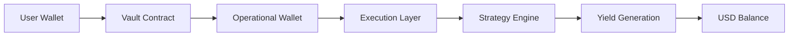

# How It Works

RondSync routes user capital across structured strategies
to generate yield with transparent execution.

---

## Overview

---

## Step 1 — Connect Wallet

Users connect their wallet to access the platform.

- No traditional account or password is required  
- The wallet address acts as the user identity  
- All interactions are cryptographically signed  

---

## Step 2 — Deposit into Vault

Users deposit USDT into a selected Vault.

- Transactions are executed on-chain  
- Funds are transferred via smart contracts  
- Each Vault defines its own parameters  
  - Duration  
  - Fee structure  
  - Strategy profile  

---

## Step 3 — Capital Routing

Deposited funds are routed to the operational wallet.

- Managed through secure infrastructure  
- Policy-controlled transaction execution  
- Multi-layer security applied to fund movement  

---

## Step 4 — Strategy Execution

Capital is deployed through a proprietary strategy engine.

- Execution is managed through internal infrastructure  
- Strategies operate across multiple venues (CEX / DEX / liquidity environments)  
- Designed to optimize execution efficiency and risk-adjusted returns  

The underlying strategy logic is not publicly disclosed. 

---

## Step 5 — Yield Generation

Returns are generated based on:

- Market conditions  
- Strategy performance  
- Liquidity availability  
- Execution efficiency  

---

## Step 6 — Daily Distribution

Yield is calculated and distributed on a daily basis.

- Reflected in the user's USD balance  
- Based on Vault share, using a unit-based system  
- Processed via periodic settlement snapshots  

---

## Step 7 — Withdraw or Redeem

Users can manage their funds flexibly.

- Withdraw available balance at any time  
- Redeem Vault positions  
- Early redemption may include penalties depending on Vault conditions  

---

## Important Notes

- Returns are not guaranteed  
- Performance depends on market conditions  
- Smart contract risks exist  
- Counterparty risks may apply depending on execution venues  
- Early redemption conditions vary by Vault  