## Overview

RondoSync operates a structured capital flow system designed to:

- Route capital efficiently  
- Apply controlled execution  
- Maintain transparency across all stages  

---

## Full Capital Lifecycle

```mermaid
flowchart LR
    A[User Wallet] --> B[Vault Contract]
    B --> C[Operational Wallet]
    C --> D[Policy Engine]
    D --> E[Execution Layer]
    E --> F[Strategy Engine]
    F --> G[Profit / Loss]
    G --> H[Settlement System]
    H --> I[USD Balance]
    I --> J[Redeem then Withdraw]
    J --> K[User Wallet]
```

---

## Step-by-Step Breakdown

### 1. User deposit

Users **deposit** funds from their wallet into a Vault (in the app this may appear as **Stake**).

- Executed via smart contracts  
- Recorded on-chain  
- Allocated to a specific Vault  

---

### 2. Vault Allocation

Funds are assigned to Vault-specific strategies.

- Each Vault operates independently  
- Capital is segmented by strategy  

---

### 3. Operational Routing

Funds are routed to operational infrastructure.

- Managed through controlled wallet systems  
- Movement governed by internal policies  

---

### 4. Policy Engine Control

All transactions pass through a policy layer.

- Whitelisting of destinations  
- Transaction limits  
- Execution rules enforcement  

---

### 5. Execution Layer

Capital is deployed across execution environments.

- Centralized platforms (CEX)  
- Decentralized protocols (DEX)  
- Liquidity venues  

---

### 6. Strategy Engine

Strategies determine how capital is utilized.

- Market-neutral approaches  
- Liquidity provision  
- Structured yield strategies  

Execution adapts to market conditions.

---

### 7. Profit generation

Profit or loss is generated based on:

- Market conditions  
- Strategy performance  
- Execution efficiency  

---

### 8. Settlement System

Results are processed and allocated.

- Periodic settlement cycles  
- Vault-level performance accounting  
- **Share**-based distribution  

---

### 9. USD Balance Reflection

User balances are updated.

- Reflects net performance  
- Includes profits and losses  
- Updated after settlement  

---

### 10. Redeem

Users **redeem** Vault **Shares** into available USD balance.

- Subject to Vault conditions  
- May include penalties or delays  

---

### 11. Withdraw

Users **withdraw** from USD balance to their wallet.

- Requires validation and approval  
- Executed through controlled processes  

---

## Control Layers

RondoSync integrates multiple control layers across the flow:

### Policy Control

- Transaction rules enforcement  
- Risk-based execution limits  

---

### Security Layer

- Wallet protection  
- Access control systems  
- Monitoring and anomaly detection  

---

### Operational Oversight

- Execution validation  
- Settlement verification  
- Internal checks and balances  

---

## Risk Exposure Points

Risk may arise at different stages:

- Market volatility during execution  
- Strategy performance variability  
- Third-party platform dependency  
- Liquidity constraints  
- Operational and technical failures  

---

## Transparency Model

RondoSync is designed to provide visibility across the system:

- Clear capital routing logic  
- Defined execution stages  
- Structured settlement process  

---

## Summary

The RondoSync fund flow is built to ensure:

- Structured capital allocation  
- Controlled execution  
- Transparent settlement  
- Flexible user access  

Capital moves through a defined lifecycle,
with controls applied at each stage to manage risk and maintain integrity.
