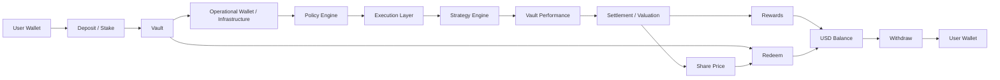

## Overview

RondoSync operates a structured capital flow system designed to support Vault-based participation, controlled execution, settlement, redeem, and withdraw processes.

The fund flow may differ depending on the specific Vault structure, supported network, strategy, operational setup, and applicable platform rules.

RondoSync is designed to:

- Route capital efficiently
- Apply controlled execution
- Maintain Vault-level accounting
- Separate Vault participation from wallet withdrawals
- Provide transparency across key stages where applicable

<Info>
In RondoSync, **Deposit**, **Redeem**, and **Withdraw** are separate actions. A user may deposit into a Vault, redeem a Vault position according to Vault rules, and withdraw available **USD Balance** to a connected wallet.
</Info>

---

## Full Capital Lifecycle

The following diagram shows a simplified capital lifecycle. Actual flows may differ depending on the Vault, network, strategy, and operational setup.

---

## Key Concepts

### Deposit / Stake

**Deposit** refers to placing funds into a Vault. In the app, this action may appear as **Stake**.

A deposit may:

- Be initiated from the user’s connected wallet
- Be executed through smart contracts
- Be recorded on-chain where applicable
- Be allocated to a specific Vault
- Be converted into **Shares** according to the applicable **Share Price** and Vault rules

Deposit does not mean that funds are immediately available for wallet withdrawal. Deposited funds become part of the selected Vault position.

---

### Shares

**Shares** represent the user’s participation in a specific Vault.

Shares may be used to determine:

- The user’s proportional participation in the Vault
- The estimated value of the user’s Vault position
- The amount received when the user redeems
- The user’s allocation of Rewards, where applicable

Shares do not represent a fixed return or guaranteed profit.

---

### Share Price

**Share Price** represents the value of one **Share** in a Vault.

Share Price may be used for:

- Deposit calculations
- Vault position valuation
- Redeem calculations

Share Price may increase or decrease based on Vault performance, asset valuation, fees, settlement results, redeem activity, and other Vault-specific accounting rules.

---

### Rewards

**Rewards** may refer to periodic amounts credited to the user’s **USD Balance**, depending on the Vault structure.

Rewards may be based on:

- Vault performance
- User **Shares**
- Settlement results
- Vault-specific reward rules
- Applicable fees or adjustments

Rewards are not fixed or guaranteed, and not all Vaults may distribute Rewards in the same way.

---

### USD Balance

**USD Balance** is an in-app balance used to track amounts that may become available for withdrawal, subject to applicable conditions.

USD Balance may include:

- Vault Rewards
- Referral rewards
- Ambassador rewards
- Redeemed amounts
- Other credited amounts, depending on platform rules

USD Balance is separate from the user’s active Vault **Shares**.

---

### Redeem

**Redeem** refers to exiting a Vault position or converting Vault value into an app balance or redeemable amount according to the applicable Vault rules.

Redeem may be affected by:

- **Share Price**
- Vault performance
- Fees
- Lock-up periods
- Early redeem penalties
- Liquidity conditions
- Processing windows
- Security, compliance, or operational checks

Redeem is separate from **Withdraw**. Redeeming a Vault position does not necessarily mean that funds are immediately sent to the user’s wallet.

---

### Withdraw

**Withdraw** refers to transferring available **USD Balance** from the RondoSync app to the user’s connected wallet.

Withdraw may be subject to:

- Available USD Balance
- Network conditions
- Security checks
- Compliance review
- Operational approval
- Transaction limits
- Supported withdrawal assets and networks

Withdraw is separate from **Redeem**. Withdraw is the wallet payout step.

---

## Step-by-Step Breakdown

### 1. User Deposit / Stake

Users **deposit** funds from their connected wallet into a Vault. In the app, this may appear as **Stake**.

- Executed through supported wallet and smart contract flows
- Recorded on-chain where applicable
- Allocated to a specific Vault
- May result in **Shares** being issued or recorded
- Subject to Vault-specific minimums, supported assets, and network rules

---

### 2. Vault Allocation

Funds are assigned to Vault-specific strategies.

- Each Vault operates independently
- Capital is segmented by strategy
- Vault parameters may differ
- Strategy exposure may differ by Vault
- Accounting treatment may differ by Vault

---

### 3. Operational Routing

Funds may be routed to operational infrastructure for execution.

- Managed through controlled wallet systems
- Movement governed by internal policies
- Routing may depend on strategy, network, liquidity, and operational requirements
- Operational wallet infrastructure may be used where applicable

---

### 4. Policy Engine Control

Transactions may pass through a policy layer.

Policy controls may include:

- Whitelisted destinations
- Transaction limits
- Execution rules
- Approval flows
- Risk-based restrictions
- Operational safeguards

These controls are designed to reduce operational risk and maintain execution integrity.

---

### 5. Execution Layer

Capital may be deployed across execution environments.

Examples may include:

- Centralized platforms
- Decentralized protocols
- Liquidity venues
- Market-making environments
- Other approved execution infrastructure

The exact execution path may differ by Vault and strategy.

---

### 6. Strategy Engine

Strategies determine how capital is utilized.

Examples may include:

- Market-neutral approaches
- Liquidity provision
- Structured yield strategies
- Other Vault-specific strategies

Execution may adapt to market conditions, liquidity, risk limits, and operational requirements.

---

### 7. Vault Performance

Vault performance may be positive or negative.

Performance may depend on:

- Market conditions
- Strategy performance
- Execution efficiency
- Liquidity conditions
- Fees and costs
- Third-party venue performance
- Operational factors

Performance is not guaranteed and may fluctuate over time.

---

### 8. Settlement / Valuation

Vault results may be processed through periodic settlement or valuation.

Depending on the Vault structure, settlement or valuation may affect:

- **Share Price**
- **Rewards**
- Redeemable value
- **USD Balance**
- Other Vault-specific accounting records

Settlement frequency, timing, and calculation logic may differ by Vault.

<Info>
Settlement does not mean that returns are fixed, guaranteed, or distributed in the same way across all Vaults.
</Info>

---

### 9. Share Price Update

Where applicable, Vault performance and accounting results may affect **Share Price**.

Share Price updates may affect:

- The number of **Shares** issued for new deposits
- Estimated Vault position value
- Redeem calculations
- Unrealized gain or loss

Because **Share Price** may rise or fall, users may experience gains or losses when they redeem.

---

### 10. Rewards Credit

Some Vaults may credit periodic **Rewards** to the user’s **USD Balance**.

Rewards may be based on:

- User **Shares**
- Vault performance
- Settlement period
- Vault-specific distribution rules
- Applicable fees or adjustments

Rewards credited to **USD Balance** are separate from the user’s active Vault **Shares**.

---

### 11. USD Balance Reflection

User **USD Balance** may be updated when amounts are credited to the app balance.

USD Balance may include:

- Vault Rewards
- Referral rewards
- Ambassador rewards
- Redeemed amounts
- Other credited amounts, depending on platform rules

USD Balance does not necessarily represent the full value of active Vault positions. Active Vault positions may remain represented by **Shares** and **Share Price**.

---

### 12. Redeem

Users may **redeem** Vault **Shares** according to the applicable Vault rules.

Redeem may:

- Convert Vault position value into a redeemed amount
- Be calculated using **Share Price**, fees, penalties, and Vault rules
- Be delayed by liquidity or processing windows
- Require security, compliance, or operational review
- Credit the resulting amount to **USD Balance** or another app-level balance, depending on platform rules

Redeem is not the same as Withdraw.

---

### 13. Withdraw

Users may **withdraw** available **USD Balance** to their connected wallet.

Withdraw may:

- Require validation and approval
- Be subject to security and compliance checks
- Be executed through controlled operational processes
- Be limited by network support, liquidity, and transaction rules
- Transfer supported assets to the user’s connected wallet

Withdraw is the step where available app balance is sent to the user’s wallet.

---

## Deposit, Redeem, and Withdraw

The following table summarizes the difference between the three actions.

| Action | Meaning | Typical Result |
| --- | --- | --- |
| Deposit / Stake | Enter a Vault using funds from a connected wallet | User receives or records Vault **Shares** |
| Redeem | Exit a Vault position according to Vault rules | Redeemed amount may be credited to **USD Balance** |
| Withdraw | Transfer available app balance to a connected wallet | Supported asset is sent to the user’s wallet |

<Info>
Redeem and Withdraw are separate processes. A user may need to redeem a Vault position before the redeemed amount becomes available for withdrawal, depending on the Vault and platform rules.
</Info>

---

## Control Layers

RondoSync integrates multiple control layers across the flow.

### Policy Control

Policy controls may include:

- Transaction rules enforcement
- Whitelisted destination management
- Risk-based execution limits
- Approval requirements
- Transfer restrictions

---

### Security Layer

Security controls may include:

- Wallet protection
- Access control systems
- Monitoring and anomaly detection
- Transaction validation
- Address and activity screening where applicable

---

### Operational Oversight

Operational oversight may include:

- Execution validation
- Settlement verification
- Internal checks and balances
- Manual review where applicable
- Exception handling

---

## Risk Exposure Points

Risk may arise at different stages of the fund flow.

Examples include:

- Market volatility during execution
- Strategy performance variability
- Third-party platform dependency
- Liquidity constraints
- Smart contract risk
- Network congestion or transaction failure
- Operational and technical failures
- Security or compliance restrictions
- Delayed settlement or redeem processing

Users should review the applicable risk disclosures and Vault-specific details before participating.

---

## Transparency Model

RondoSync is designed to provide visibility across the system where applicable.

This may include:

- Clear capital routing logic
- Defined execution stages
- Vault-level accounting
- Share-based participation
- Share Price information
- Rewards and USD Balance records
- Redeem and Withdraw history
- Structured settlement process

The availability and format of information may differ depending on the Vault, network, and user interface.

---

## Summary

The RondoSync fund flow is designed to support:

- Structured capital allocation
- Vault-specific execution
- Share-based participation
- Vault-level settlement and valuation
- Possible Rewards credited to **USD Balance**
- Redeem processing
- Controlled Withdraw to a connected wallet

Capital moves through a defined lifecycle, with controls applied across key stages to manage operational risk and maintain integrity.

Outcomes are not fixed or guaranteed. Vault performance, **Share Price**, Rewards, liquidity, fees, redeem timing, and withdrawal conditions may vary depending on the specific Vault and applicable platform rules.