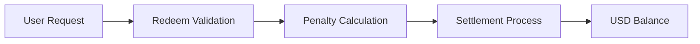

## Overview

You can **redeem** your Vault position according to each Vault’s conditions.

- **Redeeming** converts Vault **Shares** into USD balance  
- Conditions vary depending on the Vault  
- **Redeeming** early may incur penalties  

---

## Redeem flow

---

## Redeem process

### Step 1 — Request

Users start redeeming from their portfolio.

- Select Vault position  
- Specify amount (partial or full)  
- Submit request  

---

### Step 2 — Validation

The system verifies eligibility.

- Lock-up conditions  
- Vault-specific rules  
- Current position status  

---

### Step 3 — Penalty Calculation

If applicable, penalties are calculated.

- Fees for **redeeming** early  
- Strategy-related adjustments  
- Liquidity-related costs  

---

### Step 4 — Settlement

The final amount is settled and allocated.

- Net value is calculated  
- **Shares** are burned or adjusted  
- Resulting amount is added to USD balance  

---

## Full and partial redeem

### Full redeem

- Exit the entire Vault position  
- All **Shares** are converted  

---

### Partial redeem

- Exit part of the position  
- Remaining **Shares** continue to participate  

---

## Lock-up conditions

Some Vaults may enforce lock-up periods.

- You cannot **redeem** during lock-up  
- Early exit may be restricted or penalized  

---

## Penalties

Penalties may apply under certain conditions.

- Early exit fees  
- Strategy unwind costs  
- Liquidity impact adjustments  

Penalty structures vary by Vault.

---

## Settlement timing

**Redeem** requests may not settle instantly.

- Depends on Vault structure  
- Strategy execution timing  
- Liquidity availability  

---

## Important considerations

- **Redeem** rules vary per Vault  
- Early exit may reduce returns  
- Final value depends on market conditions  
- Partial **redeem** affects remaining exposure  

---

## Relationship to Withdraw

**Redeem** and **Withdraw** are different:

- **Redeem** → converts a Vault position into USD balance  
- **Withdraw** → sends USD balance from the platform to your wallet  

---

## Summary

**Redeem** lets you:

- Exit Vault positions  
- Manage capital allocation  
- Control exposure to strategies  

Every **redeem** is subject to Vault-specific rules
and market conditions.
