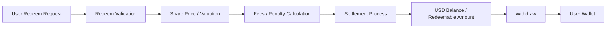

## Overview

**Redeem** refers to exiting a Vault position according to the applicable Vault rules.

Redeem is separate from **Withdraw**.

- **Redeem** exits a Vault position
- **Withdraw** transfers available **USD Balance** to a connected wallet
- Redeem may convert Vault **Shares** into **USD Balance** or another redeemable app balance, depending on platform and Vault rules
- Redeem conditions vary depending on the Vault
- Early Redeem may be restricted, delayed, or subject to penalties

<Info>
Redeem does not necessarily send funds directly to the user’s wallet. A user may need to complete **Redeem** first, then submit a **Withdraw** request to transfer available **USD Balance** to their connected wallet.
</Info>

---

## Redeem Flow

---

## Redeem Process

### Step 1 — Request

Users start a **Redeem** request from their portfolio.

A request may include:

- Selected Vault position
- Full or partial Redeem amount
- Number of **Shares** to redeem
- Confirmation of Vault rules
- User confirmation before submission

The available Redeem options may differ depending on the Vault.

---

### Step 2 — Eligibility Check

The system verifies whether the position is eligible for Redeem.

Eligibility checks may include:

- Lock-up conditions
- Minimum holding period
- Vault-specific rules
- Position status
- Minimum remaining position requirements
- Supported Redeem windows
- Account, security, or compliance restrictions

If a position is not eligible, the Redeem request may be rejected, delayed, or restricted.

---

### Step 3 — Valuation

The system calculates or references the value of the Vault position according to the applicable Vault rules.

Valuation may depend on:

- **Share Price**
- Number of **Shares** being redeemed
- Vault performance
- Settlement timing
- Asset valuation
- Fees
- Liquidity conditions
- Other Vault-specific accounting rules

Because **Share Price** may rise or fall, the redeemable value may be higher or lower than the original deposit amount.

---

### Step 4 — Fees and Penalty Calculation

If applicable, fees or penalties are calculated.

Possible adjustments may include:

- Early Redeem penalties
- Performance fees
- Strategy unwind costs
- Liquidity impact adjustments
- Network or operational costs
- Other Vault-specific fees

Fees and penalties may reduce the final amount credited after Redeem.

---

### Step 5 — Settlement

The final amount is settled according to Vault rules.

Settlement may include:

- Calculating net redeemable value
- Reducing or burning redeemed **Shares**
- Applying fees or penalties
- Updating the user’s Vault position
- Crediting the resulting amount to **USD Balance** or another app-level redeemable balance, depending on platform rules

Settlement timing may vary by Vault and may not be instant.

---

## Full and Partial Redeem

### Full Redeem

A full **Redeem** exits the entire Vault position.

A full Redeem may:

- Redeem all **Shares** in the selected Vault position
- Close the user’s exposure to that Vault
- Apply applicable fees, penalties, or adjustments
- Credit the resulting amount according to platform and Vault rules

---

### Partial Redeem

A partial **Redeem** exits only part of the Vault position.

A partial Redeem may:

- Redeem only selected **Shares** or a selected amount
- Reduce the user’s exposure to the Vault
- Leave remaining **Shares** active
- Allow the remaining position to continue participating in Vault performance
- Affect future Rewards, if applicable

Partial Redeem rules may differ by Vault.

---

## Lock-Up Conditions

Some Vaults may enforce lock-up periods or minimum holding periods.

Lock-up conditions may include:

- No Redeem during the lock-up period
- Restricted Redeem during certain windows
- Early Redeem penalties
- Minimum holding periods before Redeem is allowed
- Delayed processing until the next available Redeem window

Users should review lock-up conditions before depositing into a Vault.

---

## Penalties and Adjustments

Penalties or adjustments may apply under certain conditions.

Examples include:

- Early exit fees
- Strategy unwind costs
- Liquidity impact adjustments
- Operational fees
- Network costs
- Vault-specific adjustment factors

Penalty structures vary by Vault and may change according to Vault rules.

<Info>
The amount received after Redeem may be lower than the user’s original deposit or estimated position value due to market performance, **Share Price** movement, fees, penalties, liquidity conditions, or timing.
</Info>

---

## Settlement Timing

**Redeem** requests may not settle instantly.

Settlement timing may depend on:

- Vault structure
- Strategy execution timing
- Liquidity availability
- Settlement windows
- Valuation timing
- Operational processing
- Security checks
- Compliance review
- Network conditions

Some Redeem requests may be processed automatically, while others may require manual review or delayed settlement.

---

## Relationship to Share Price

**Share Price** may play an important role in Redeem calculations.

Redeem value may be affected by:

- **Share Price** at the applicable valuation time
- Number of **Shares** being redeemed
- Vault performance
- Fees and penalties
- Settlement timing
- Vault-specific accounting rules

If **Share Price** has increased, the estimated redeemable value may increase.  
If **Share Price** has decreased, the estimated redeemable value may decrease.

This does not guarantee any profit or final redeem amount.

---

## Relationship to Rewards

Depending on the Vault structure, Rewards may be handled separately from Redeem.

For example:

- Some Vaults may credit periodic **Rewards** to **USD Balance**
- Some Vaults may reflect performance mainly through **Share Price**
- Some Vaults may use a combination of **Share Price** movement and Rewards
- Redeeming **Shares** may reduce future Reward eligibility
- Pending Rewards may be subject to Vault-specific rules

Users should review each Vault’s rules to understand how Redeem affects Rewards.

---

## Relationship to Withdraw

**Redeem** and **Withdraw** are different actions.

| Action | Meaning | Typical Result |
| --- | --- | --- |
| Redeem | Exit a Vault position according to Vault rules | Redeemed amount may be credited to **USD Balance** or another app-level balance |
| Withdraw | Transfer available app balance to a connected wallet | Supported asset is sent to the user’s wallet |

<Info>
Redeem does not directly transfer funds to the user’s wallet. **Withdraw** is the step that transfers available **USD Balance** to the user’s connected wallet.
</Info>

---

## Important Considerations

- Redeem rules vary per Vault
- Redeem may not be available at all times
- Early Redeem may be restricted or penalized
- Final value depends on **Share Price**, Vault performance, fees, penalties, liquidity, and timing
- Negative performance may reduce redeemable value
- Partial Redeem affects remaining exposure
- Redeem may reduce future Rewards, where applicable
- Settlement may be delayed
- Security, compliance, or operational checks may apply
- Redeem does not automatically mean Withdraw to wallet

Users should review the specific Vault details, risk disclosures, and applicable terms before submitting a Redeem request.

---

## Summary

**Redeem** lets users exit Vault positions according to Vault-specific rules.

Redeem may involve:

- Selecting a Vault position
- Redeeming all or part of the user’s **Shares**
- Calculating value based on **Share Price** and Vault rules
- Applying applicable fees or penalties
- Settling the resulting amount into **USD Balance** or another app-level balance
- Reducing or closing exposure to the selected Vault

Redeem is separate from **Withdraw**. To move available app balance to a connected wallet, the user must complete a **Withdraw** request where applicable.

Every Redeem is subject to Vault-specific rules, market conditions, fees, liquidity, settlement timing, and operational controls.