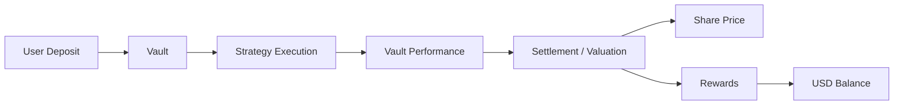

## Overview

Users **deposit** into Vaults and hold **Shares** to participate in structured strategies.

Each Vault may have its own strategy, parameters, accounting rules, fee structure, lock-up conditions, and redeem logic.

- Each Vault operates independently
- Capital is deployed according to a Vault-specific strategy
- **Shares** represent participation in a specific Vault
- **Share Price** may change over time
- Rewards may be credited to **USD Balance**, depending on the Vault structure
- Returns are not fixed and may vary depending on Vault performance, market conditions, fees, and redeem timing

Users should always review the details of each Vault before participating.

---

## Key Characteristics

### Strategy-Based Allocation

Each Vault is tied to a specific strategy or strategy group.

Examples may include:

- Market-neutral strategies
- Liquidity provision
- Structured yield strategies
- Other capital-efficient approaches
- Other Vault-specific strategies

Actual strategies may differ by Vault and may change over time according to Vault rules, market conditions, risk controls, or operational requirements.

---

### Independent Performance

Vaults do not share performance by default.

- Performance is tracked per Vault
- Gains or losses are generally isolated by Vault
- Users choose exposure individually
- Vault parameters may differ across Vaults
- Accounting treatment may differ across Vaults

A user’s outcome depends on the specific Vault selected, the timing of deposit and redeem, Vault performance, applicable fees, and other Vault-specific rules.

---

### Share-Based System

Vaults use **Share**-based accounting.

- A **deposit** may be converted into **Shares**
- Each **Share** represents one unit of participation in the Vault
- **Share Price** may be used for deposit, valuation, and redeem calculations
- Vault performance may affect **Share Price**, **Rewards**, or both
- Rewards may be credited to the user’s **USD Balance**, depending on the Vault structure

<Info>
The way performance is reflected may differ by Vault. Some Vaults may primarily reflect performance through **Share Price** movements, while others may also credit periodic **Rewards** to **USD Balance**.
</Info>

---

## Vault Parameters

Each Vault defines its own parameters. These parameters should be reviewed before participating.

### Minimum Deposit

The minimum amount required to enter a Vault.

- Minimum deposit amounts may differ by Vault
- Some Vaults may have higher entry requirements
- Deposits below the minimum may not be accepted

---

### Asset

The asset accepted by the Vault.

Examples may include:

- USDT
- Other supported stablecoins
- Other supported digital assets, depending on the Vault

Supported assets may differ by Vault and by network.

---

### Network

Each Vault may operate on one or more supported networks.

- Network availability may differ by Vault
- Deposit and redeem flows may depend on the selected network
- Gas fees and transaction confirmation times may vary by network

Users should confirm that they are using the correct network before depositing.

---

### Duration

Vault participation may be flexible or subject to a fixed period.

- Some Vaults may have a fixed investment period
- Some Vaults may allow flexible participation
- Some Vaults may have a minimum holding period
- Some Vaults may restrict redeem requests during certain periods

The applicable duration depends on each Vault’s rules.

---

### Redeem Conditions

**Redeem** refers to exiting a Vault position and converting Vault value back into an app balance or redeemable amount according to the applicable Vault rules.

Redeem conditions may include:

- Minimum holding periods
- Lock-up periods
- Early redeem restrictions
- Early redeem penalties
- Processing windows
- Liquidity-dependent delays
- Manual or automated review

Redeem conditions differ by Vault and may affect the final amount received.

---

### Fee Structure

Each Vault may define its own fee structure.

Possible fees may include:

- Performance fees
- Management or strategy fees
- Strategy execution costs
- Network or transaction costs
- Early redeem penalties
- Other operational fees

Fees may affect **Share Price**, Rewards, redeem amounts, or other Vault-level accounting records depending on the Vault structure.

---

### Rewards Treatment

Some Vaults may credit periodic **Rewards** to the user’s **USD Balance**.

Rewards treatment may differ by Vault, including:

- Whether Rewards are distributed
- How Rewards are calculated
- How often Rewards are credited
- Whether Rewards are based on **Shares**
- Whether Rewards are subject to fees, review, or other conditions
- When credited Rewards become available for **Withdraw**

Rewards are not fixed or guaranteed.

---

## How to Choose a Vault

Users should consider the following factors before choosing a Vault.

### Risk Profile

Different Vaults may carry different risk levels.

Users should consider:

- Strategy complexity
- Market exposure
- Volatility
- Liquidity risk
- Smart contract risk
- Counterparty or execution risk
- Operational risk
- Potential for negative performance

Higher expected returns may involve higher risk.

---

### Liquidity

Vault liquidity determines how easily a user may exit a Vault position.

Users should review:

- Lock-up periods
- Redeem windows
- Early redeem penalties
- Liquidity conditions
- Processing timelines
- Whether redeem requests may be delayed or restricted

Liquidity conditions may affect when and how users can access funds.

---

### Expected Behavior

Users should understand how each Vault is intended to behave.

Consider:

- Whether performance is expected to be stable or variable
- Whether Rewards may be credited to **USD Balance**
- Whether performance is mainly reflected through **Share Price**
- Whether the Vault is sensitive to market volatility
- Whether the strategy depends on liquidity, spreads, funding rates, or other market conditions

Expected behavior is not a guarantee of actual results.

---

### Fees and Net Returns

Users should review fees and understand how they may affect net results.

Fees may reduce:

- Vault value
- **Share Price**
- Rewards
- Redeem amounts
- Overall user returns

The impact of fees may differ by Vault.

---

## Capital Flow (Simplified)

The following illustrates a simplified Vault flow. Actual flows may differ depending on the Vault structure.

---

## Example Vault (Illustrative)

<Note>
The following is a simplified example for illustration purposes only. It does not represent guaranteed terms, fixed returns, or the exact structure of any specific Vault. Actual Vault parameters may vary and are subject to change.
</Note>

### Sample Parameters

| Parameter | Value |
| --- | --- |
| Asset | USDT |
| Minimum Deposit | 500 USDT |
| Network | BNB Chain |
| Lock-up Period | Flexible |
| Redeem | Allowed subject to Vault rules and liquidity conditions |
| Performance Fee | 20% |
| Execution / Operational Fees | Included in strategy performance or applied according to Vault rules |
| Rewards | May be credited to USD Balance depending on Vault rules |

---

### Share-Based Structure

Vaults use **Share**-based accounting.

- Users may receive **Shares** when they **deposit**
- **Share Price** may move over time
- Vault performance may affect **Share Price**
- Some Vaults may also credit **Rewards** to **USD Balance**
- Negative performance may reduce the estimated value of a Vault position

---

### Example Calculation: Share Price Movement

The following example shows how **Share Price** movement may affect a user’s estimated Vault position value.

#### Initial State

| Item | Value |
| --- | --- |
| Total Vault Assets | 100,000 USDT |
| Total **Shares** issued | 100,000 |
| **Share Price** | 1.0000 USDT |

#### User Deposit

| Item | Value |
| --- | --- |
| Deposit Amount | 1,000 USDT |
| Share Price at Deposit | 1.0000 USDT |
| **Shares** received | 1,000 Shares |

#### After Share Price Movement

If the **Share Price** rises to 1.0500 USDT:

| Item | Value |
| --- | --- |
| **Shares** held | 1,000 Shares |
| Current **Share Price** | 1.0500 USDT |
| Estimated Position Value | 1,050 USDT |
| Unrealized Gain | +50 USDT |

If the **Share Price** falls to 0.9500 USDT:

| Item | Value |
| --- | --- |
| **Shares** held | 1,000 Shares |
| Current **Share Price** | 0.9500 USDT |
| Estimated Position Value | 950 USDT |
| Unrealized Loss | -50 USDT |

This example is for illustration only. Actual redeem amounts may be affected by fees, penalties, liquidity, timing, and Vault-specific rules.

---

### Example Calculation: Rewards Credited to USD Balance

Some Vaults may also credit periodic **Rewards** to the user’s **USD Balance**.

The following example is simplified and provided for illustration only.

| Item | Value |
| --- | --- |
| Total Vault Shares | 100,000 Shares |
| User Shares | 1,000 Shares |
| User Participation Ratio | 1.00% |

Assume the Vault has 10,000 USDT of distributable Rewards for the relevant settlement period.

| Item | Value |
| --- | --- |
| Distributable Rewards | 10,000 USDT |
| User Participation Ratio | 1.00% |
| User Rewards | 100 USDT |

The user may receive:

| Item | Value |
| --- | --- |
| Rewards Credited | 100 USDT |
| Credited To | USD Balance |

The user’s Vault **Shares** remain separate from the user’s **USD Balance**.

Credited Rewards may become available for **Withdraw**, subject to the applicable Vault rules, platform conditions, security checks, and compliance review.

---

### Key Insight

<Info>
- **Share Price** may change over time based on Vault performance and accounting rules.
- Users do not earn a fixed or guaranteed rate of profit.
- Returns may come from **Share Price** movement, **Rewards** credited to **USD Balance**, or a combination of both.
- Negative performance may occur and may reduce **Share Price** or redeemable value.
- Reward timing, redeem conditions, fees, and accounting treatment may differ by Vault.
</Info>

---

## Important Considerations

- Each Vault carries its own risk
- Past performance does not guarantee future results
- Profit is not guaranteed
- Negative performance may occur
- **Share Price** may increase or decrease
- Rewards may vary by Vault
- Strategy changes may occur over time
- Liquidity conditions may affect access to funds
- Fees may reduce net returns
- Redeem timing may affect the final outcome
- Compliance, security, or operational checks may apply

Users should review the specific Vault details, risk disclosures, and applicable terms before participating.

---

## Summary

Vaults provide structured access to strategies through:

- Segmented capital allocation
- Strategy-specific execution
- **Share**-based accounting
- Vault-level **Share Price**
- Vault-specific redeem conditions
- Possible **Rewards** credited to **USD Balance**, depending on the Vault structure
- Transparent performance tracking where applicable

Users are encouraged to understand each Vault before participating.

Vault performance is not fixed or guaranteed. Outcomes may vary depending on market conditions, strategy execution, fees, liquidity, Vault rules, and redeem timing.