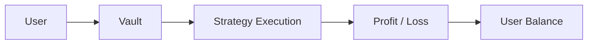

## Overview

Users **deposit** into Vaults and hold **Shares** to participate in structured strategies.

- Each Vault operates independently  
- Capital is deployed according to a predefined strategy  
- Returns vary depending on performance and market conditions  

---

## Key Characteristics

### Strategy-Based Allocation

Each Vault is tied to a specific strategy.

- Market-neutral strategies  
- Liquidity provision  
- Structured yield strategies  
- Other capital-efficient approaches  

---

### Independent Performance

Vaults do not share performance.

- Returns are calculated per Vault  
- Losses or gains are isolated  
- Users choose exposure individually  

---

### Share-based system

Vaults use **Share**-based accounting.

- A **deposit** is converted into **Shares**  
- Each **Share** is one unit of participation in the Vault  
- Results are reflected through **Share Price** changes or distributions  

---

## Vault Parameters

Each Vault defines its own parameters.

### Minimum Deposit

- Defines the minimum capital required to enter  

---

### Duration

- Some Vaults may have a fixed investment period  
- Others may allow flexible participation  

---

### Redeem conditions

- **Redeeming** early may be restricted  
- Penalties may apply depending on Vault rules  

---

### Fee Structure

- Performance fees  
- Strategy execution costs  
- Other operational fees  

---

## How to Choose a Vault

Users should consider the following factors:

### Risk Profile

- Strategy complexity  
- Market exposure  
- Volatility tolerance  

---

### Liquidity

- Lock-up periods  
- Flexibility to **redeem**  

---

### Expected Behavior

- Stable vs variable **profit**  
- Strategy dependency on market conditions  

---

## Capital Flow (Simplified)

The following illustrates how capital flows through the system:

## Example Vault (Illustrative)

<Note>
  The following is a simplified example for illustration purposes only.
  Actual Vault parameters vary and are subject to change.
</Note>

### Sample Parameters

| Parameter | Value |
|---|---|
| Asset | USDT |
| Minimum Deposit | 500 USDT |
| Lock-up Period | Flexible |
| Redeem | Allowed anytime (conditions may apply) |
| Performance Fee | 20% |
| Execution / Operational Fees | Included in strategy performance |

---

### Share-based structure

Vaults use **Share**-based accounting.

- Users receive **Shares** when they **deposit**
- **Share Price** moves over time
- Total Vault performance is reflected in **Share Price**

---

### Example Calculation

**Initial State**

| Item | Value |
|---|---|
| Total Vault Assets | 100,000 USDT |
| Total **Shares** issued | 100,000 |
| **Share Price** | 1.0000 USDT |

**User Deposit**

| Item | Value |
|---|---|
| Deposit Amount | 1,000 USDT |
| **Shares** received | 1,000 |

**After profit accrues** (example: **Share Price** rises to 1.05 USDT)

| Item | Value |
|---|---|
| **Shares** held | 1,000 |
| **Share Price** | 1.0500 USDT |
| Portfolio Value | 1,050 USDT |
| Unrealized Gain | +50 USDT |

---

### Key Insight

<Info>
  - **Share Price** changes over time based on Vault performance
  - Users do not earn a fixed rate of **profit**
  - Returns are based on **Share Price** appreciation
  - Negative performance may also occur, reducing **Share Price**
</Info>

---

## Important Considerations

- Each Vault carries its own risk  
- Past performance does not guarantee future results  
- Strategy changes may occur over time  
- Liquidity conditions may affect access to funds  

---

## Summary

Vaults provide structured access to strategies through:

- Segmented capital allocation  
- Strategy-specific execution  
- Transparent performance tracking  

Users are encouraged to understand each Vault before investing.

