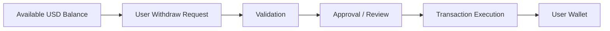

## Overview

**Withdraw** refers to transferring available **USD Balance** from the RondoSync app to the user’s connected wallet.

Withdraw is separate from **Redeem**.

- **Redeem** exits a Vault position according to Vault rules
- **Withdraw** transfers available **USD Balance** to a connected wallet
- Active Vault **Shares** cannot be withdrawn directly
- Withdraw requests may require validation, approval, security checks, or compliance review

<Info>
A user may need to **redeem** a Vault position before the redeemed amount becomes available for **Withdraw**, depending on the Vault and platform rules.
</Info>

---

## What Can Be Withdrawn

Only available **USD Balance** may be withdrawn.

**USD Balance** may include:

- Vault **Rewards**
- Referral rewards
- Ambassador rewards
- Redeemed amounts
- Other credited amounts, depending on platform rules

The following generally cannot be withdrawn directly:

- Active Vault **Shares**
- Pending Rewards
- Locked or restricted balances
- Amounts under review
- Amounts subject to compliance, security, or operational restrictions

---

## Withdraw Flow

---

## Withdraw Process

### Step 1 — Request

Users start a **Withdraw** request from their dashboard.

The request may include:

- Withdraw amount
- Connected wallet address
- Selected network
- Supported withdrawal asset
- Confirmation by the user

Users should carefully confirm the wallet address, network, and asset before submitting a request.

---

### Step 2 — Balance Check

The system checks whether the requested amount is available for withdrawal.

Checks may include:

- Available **USD Balance**
- Minimum withdraw amount
- Maximum withdraw thresholds
- Daily or periodic limits
- Pending transactions
- Locked or restricted amounts

Only available **USD Balance** can proceed to the next step.

---

### Step 3 — Validation

The system performs validation checks before execution.

Validation may include:

- Wallet address validation
- Network support validation
- Balance availability
- Policy enforcement
- Transaction rule checks
- Risk-based checks
- Security checks
- Compliance review where applicable

---

### Step 4 — Approval

**Withdraw** requests may require approval before execution.

Approval may be:

- Automated
- Manual
- Risk-based
- Compliance-based
- Required for certain amounts, addresses, networks, or account conditions

A Withdraw request may be delayed, rejected, or restricted if it fails validation, triggers risk controls, or requires additional review.

---

### Step 5 — Execution

Approved **Withdraw** transfers are executed on-chain.

Execution may include:

- Preparing the transaction
- Signing through controlled wallet infrastructure
- Broadcasting the transaction
- Waiting for network confirmation
- Updating the request status after confirmation

Completion depends on network conditions, infrastructure availability, policy controls, and operational review where applicable.

---

## Processing Time

How long a **Withdraw** takes may vary depending on:

- Network congestion
- Selected network
- Transaction confirmation time
- Internal validation processes
- Security checks
- Compliance review
- Operational approval
- Liquidity availability
- Wallet infrastructure availability

Users should expect delays during peak conditions, abnormal activity, maintenance, or additional review.

---

## Limits

Certain limits may apply to **Withdraw** requests.

Examples include:

- Minimum withdraw amount
- Maximum withdraw amount
- Daily limits
- Periodic limits
- Per-account limits
- Per-wallet limits
- Network-specific limits
- Risk-based limits

Limits may differ depending on user status, account activity, platform policy, network conditions, and operational requirements.

---

## Fees

A **Withdraw** may incur fees.

Possible fees include:

- Network transaction fees
- Gas fees
- Operational fees
- Processing fees
- Other applicable fees depending on the selected network or platform rules

Fees may reduce the final amount received by the user.

Fee structures may differ by network, asset, and platform conditions, and may change over time.

---

## Redeem vs Withdraw

**Redeem** and **Withdraw** are separate actions.

| Action | Meaning | Typical Result |
| --- | --- | --- |
| Redeem | Exit a Vault position according to Vault rules | Redeemed amount may be credited to **USD Balance** |
| Withdraw | Transfer available app balance to a connected wallet | Supported asset is sent to the user’s wallet |

<Info>
Withdraw does not directly exit a Vault. To access value from active Vault **Shares**, the user may need to submit a **Redeem** request first, subject to Vault rules.
</Info>

---

## Important Considerations

- Only available **USD Balance** can be withdrawn
- Active Vault **Shares** cannot be withdrawn directly
- Pending or locked funds cannot be accessed
- Withdraw may require approval or review
- Security, compliance, or operational checks may apply
- Withdraw requests may be delayed, rejected, or restricted
- Incorrect wallet addresses may result in permanent loss
- Selecting the wrong network may result in permanent loss
- Transactions are generally irreversible once executed
- Fees may reduce the final amount received
- Network congestion may delay completion

Users should review all withdraw details carefully before submitting a request.

---

## Security Model

RondoSync applies multiple layers of security to the Withdraw process.

Security controls may include:

- Policy-based transaction control
- Wallet infrastructure protection
- Destination address validation
- Transaction limits
- Approval workflows
- Monitoring and anomaly detection
- Risk-based review
- Compliance checks where applicable

These controls are designed to reduce operational risk and protect the integrity of the withdrawal process.

---

## Withdraw Status

A Withdraw request may move through several statuses.

Example statuses may include:

| Status | Meaning |
| --- | --- |
| Pending | The request has been submitted and is waiting for processing |
| Under Review | The request is undergoing validation, approval, or compliance checks |
| Approved | The request has been approved for execution |
| Processing | The on-chain transaction is being prepared or executed |
| Completed | The transaction has been confirmed and the request is complete |
| Rejected | The request was not approved or could not be processed |
| Failed | The transaction or processing attempt failed |

Actual statuses may differ depending on the user interface and operational setup.

---

## Summary

**Withdraw** is the process of transferring available **USD Balance** from RondoSync to the user’s connected wallet.

Withdraw is designed to be:

- Controlled
- Validated
- Policy-based
- Security-aware
- Separate from Vault **Redeem**

Users may withdraw available **USD Balance** only. Active Vault **Shares**, pending amounts, locked balances, or restricted funds cannot be withdrawn directly.

Withdraw outcomes and processing times may vary depending on network conditions, platform rules, security checks, compliance review, liquidity, and operational requirements.