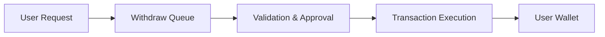

## Overview

You can **withdraw** your available USD balance to your wallet.

- **Withdraw** requests are processed on request  
- Funds are sent to the connected wallet  
- Processing may require approval and validation  

---

## Withdraw flow

---

## Withdraw process

### Step 1 — Request

Users start a **withdraw** from their dashboard.

- Specify amount  
- Confirm wallet destination  
- Submit request  

---

### Step 2 — Validation

The system performs validation checks.

- Balance availability  
- Security checks  
- Policy enforcement  

---

### Step 3 — Approval

**Withdraw** requests may require approval before execution.

- Automated or manual approval  
- Risk-based review  
- Compliance checks  

---

### Step 4 — Execution

Approved **withdraw** transfers are executed on-chain.

- Funds are transferred to the user's wallet  
- Transaction is broadcast and confirmed  
- Completion depends on network conditions  

---

## Processing time

How long a **withdraw** takes may vary depending on:

- Network congestion  
- Internal validation processes  
- Security or compliance checks  

Users should expect delays during peak conditions.

---

## Limits

Certain limits may apply:

- Minimum **withdraw** amount  
- Maximum thresholds  
- Daily or periodic limits  

---

## Fees

A **withdraw** may incur fees, including:

- Network transaction fees  
- Operational fees  

Fee structures may change over time.

---

## Important considerations

- Only available USD balance can be **withdrawn**  
- Pending or locked funds cannot be accessed  
- Incorrect wallet addresses may result in permanent loss  
- Transactions are irreversible once executed  

---

## Security model

RondoSync applies multiple layers of security:

- Policy-based transaction control  
- Wallet infrastructure protection  
- Monitoring and anomaly detection  

---

## Summary

**Withdraw** to your wallet is designed to be:

- Secure  
- Transparent  
- Policy-controlled  

Users retain control over their funds while the system ensures
safe and structured execution.
