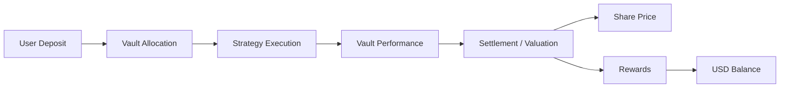

## Overview

RondoSync uses Vault-based accounting to track strategy performance and user participation.

Depending on the specific Vault structure, performance may be reflected through:

- **Share Price** movements
- **Rewards** credited to the user’s **USD Balance**
- A combination of **Share Price** changes and periodic **Rewards**

In many Vaults, **Share Price** is used for **deposit** and **redeem** calculations, while periodic **Rewards** may be credited to the user’s **USD Balance** based on the user’s **Shares** and the applicable Vault rules.

Actual reward timing, calculation methods, fees, lock-up periods, redeem conditions, and accounting treatment may differ by Vault. Users should always review the specific Vault details before participating.

---

## Performance flow

---

## How performance is generated

Vault performance may come from a combination of:

- Market opportunities
- Strategy execution efficiency
- Liquidity provisioning
- Structured financial strategies
- Other Vault-specific strategies

Outcomes depend on market conditions, execution performance, liquidity, fees, operational factors, and the specific rules of each Vault.

---

## Settlement and accounting

Vault performance may be processed through periodic settlement and accounting.

Depending on the Vault structure, settlement may affect:

- **Share Price**
- **Rewards**
- **USD Balance**
- Redeemable value
- Other Vault-specific balances or accounting records

Settlement frequency, calculation logic, and timing may differ by Vault.

<Info>
Daily or periodic settlement does not mean that returns are fixed, guaranteed, or paid in the same way across all Vaults.
</Info>

---

## Share-based participation

Each user holds **Shares** in a Vault. A **Share** represents one unit of participation in that specific Vault.

Shares may be used to determine:

- The user’s proportional participation in a Vault
- The estimated value of the user’s Vault position
- The amount received when the user redeems
- The user’s allocation of Rewards, where applicable

More **Shares** generally represent a larger participation in the Vault, but they do not guarantee profit or a fixed return.

---

## Share Price

Each Vault may have a **Share Price**, which represents the value of one **Share** in that Vault.

**Share Price** may change over time based on:

- Vault-level performance
- Asset valuation
- Profit or loss
- Fees
- Settlement results
- Redeem activity
- Other Vault-specific accounting rules

**Share Price** is commonly used for:

- Calculating how many **Shares** a user receives when depositing
- Estimating the value of a user’s Vault position
- Calculating redeem amounts when a user exits a Vault

Because **Share Price** may rise or fall, users may experience profit or loss when they redeem their Vault position.

---

## Rewards and USD Balance

In many Vaults, periodic profit may be credited to the user’s **USD Balance** as **Rewards**.

Rewards are generally calculated based on the user’s participation in the Vault, such as the number of **Shares** held during the relevant settlement period.

**USD Balance** may include:

- Vault **Rewards**
- Referral rewards
- Ambassador rewards
- Redeemed amounts
- Other credited amounts, depending on platform rules

Available **USD Balance** may be withdrawn to the user’s connected wallet, subject to applicable conditions, security checks, and compliance review.

<Info>
Rewards credited to **USD Balance** are separate from the user’s Vault **Shares**. A user may hold Vault **Shares** and also have a separate **USD Balance** within the app.
</Info>

---

## Example: Share Price movement

The following example is simplified and provided for illustration only. Actual Vault accounting may differ depending on the Vault structure.

### Initial state

| Item | Value |
| --- | --- |
| User Deposit | 1,000 USDT |
| Share Price at Deposit | 1.0000 USDT |
| Shares Received | 1,000 Shares |

If the **Share Price** later changes to 1.0500 USDT:

| Item | Value |
| --- | --- |
| User Shares | 1,000 Shares |
| Current Share Price | 1.0500 USDT |
| Estimated Position Value | 1,050 USDT |

In this example, the user’s estimated Vault position value increases because the **Share Price** increased.

If the **Share Price** decreases, the estimated position value may also decrease.

---

## Example: Rewards credited to USD Balance

Some Vaults may also distribute periodic **Rewards** to the user’s **USD Balance**.

The following example is simplified and provided for illustration only.

### Example scenario

| Item | Value |
| --- | --- |
| Total Vault Shares | 100,000 Shares |
| User Shares | 1,000 Shares |
| User Participation Ratio | 1.00% |

Assume the Vault has 10,000 USDT of distributable Rewards for the relevant settlement period.

| Item | Value |
| --- | --- |
| Distributable Rewards | 10,000 USDT |
| User Participation Ratio | 1.00% |
| User Rewards | 100 USDT |

### User outcome

| Item | Value |
| --- | --- |
| Rewards Credited | 100 USDT |
| Credited To | USD Balance |

The user’s Vault **Shares** remain separate from the **USD Balance**.

The credited **Rewards** may become available for **Withdraw**, subject to the applicable Vault rules, platform conditions, security checks, and compliance review.

---

## Key understanding

<Info>
- Vault performance may affect **Share Price**, **Rewards**, or both.
- **Share Price** may rise or fall.
- **Rewards** may be credited to **USD Balance**, depending on the Vault structure.
- **Shares** represent participation in a Vault, not a guaranteed return.
- Reward timing, accounting logic, and redeem conditions may differ by Vault.
</Info>

---

## Important considerations

- Profit is not guaranteed
- Results may fluctuate significantly
- Negative performance may occur
- **Share Price** may increase or decrease
- Rewards may vary by Vault
- Distribution timing may vary by Vault
- Fees, lock-up periods, redeem conditions, and settlement logic may differ by Vault
- Market conditions and execution performance directly impact outcomes

Users should review the specific Vault details, risk disclosures, and applicable terms before participating.

---

## Transparency model

RondoSync is designed to provide clear Vault-level information where applicable.

This may include:

- Vault details
- Share-based accounting
- Share Price information
- Reward records
- USD Balance records
- Redeem and Withdraw history
- Strategy-linked performance information

The availability and format of this information may differ depending on the Vault and the user interface.

---

## Summary

Vault performance in RondoSync may be reflected through:

- **Share Price** movements
- **Rewards** credited to **USD Balance**
- A combination of both, depending on the Vault structure

Users participate based on their selected Vault, deposited capital, received **Shares**, and the applicable Vault rules.

Profit is not fixed or guaranteed, and users may experience both gains and losses depending on Vault performance, market conditions, fees, and redeem timing.