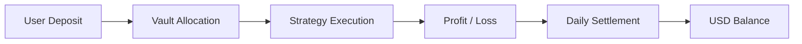

## Overview

Strategy execution produces profit or loss, which is allocated proportionally
based on your participation in each Vault.

- **Profit** is not fixed and varies over time  
- Distribution follows Vault performance  
- Allocation is proportional to your **Shares**  

---

## Profit flow

---

## How profit is generated

Results come from a combination of:

- Market opportunities  
- Strategy execution efficiency  
- Liquidity provisioning  
- Structured financial strategies  

Outcomes depend on both market conditions and execution performance.

---

## Daily distribution mechanism

**Profit** (and loss) is applied through a daily settlement process.

- Performance is calculated periodically  
- Results are allocated to each Vault  
- Users receive **profit** in proportion to their **Shares**  

---

## Share-based allocation

Each user holds **Shares** in a Vault; each **Share** is one unit (1口) of participation.

- **Profit** is allocated proportionally  
- More **Shares** mean a larger allocation  
- **Share** accounting keeps distribution fair  

---

## Example: Share-based allocation

RondoSync uses **Share**-based accounting.

### Core principle

- Vault performance is aggregated  
- Total **profit** is spread across all **Shares**  
- Each user receives **profit** in proportion to **Share** ownership  

---

### Example scenario

**Initial state:**

| Item | Value |
|---|---|
| Total Vault Assets | 100,000 USDT |
| Total **Shares** issued | 100,000 |
| **Share Price** | 1.0000 USDT |

**Deposit**

- User **deposits** 1,000 USDT  
- Receives 1,000 **Shares**  

---

### Profit generation

Assume the Vault generates:

- Total **profit**: 10,000 USDT  

**New state:**

| Item | Value |
|---|---|
| Total Assets | 110,000 USDT |
| Total **Shares** issued | 100,000 |
| New **Share Price** | 1.1000 USDT |

---

### User outcome

User holds:

- 1,000 **Shares**  

Value:

- 1,000 **Shares** × 1.1000 USDT = 1,100 USDT  

👉 **Profit = 100 USDT**

---

### Key understanding

<Info>
- **Profit** is not paid as fixed “payouts”  
- It is reflected through **Share Price** increases  
- Each **Share** is a proportional claim on total assets  
</Info>

---

### Important note

**Share Price** may:

- Rise (**profit**)  
- Fall (loss)  

Outcomes depend entirely on Vault performance.

---

## USD balance

Distributed **profit** appears in the user’s USD balance.

- Accumulates over time  
- Includes **profit**, loss, and settlement amounts  
- Available for **Withdraw** (to your wallet) subject to conditions  

---

## Important considerations

- **Profit** is not guaranteed  
- Results may fluctuate significantly  
- Negative performance may occur  
- Market conditions directly impact outcomes  

---

## Transparency model

RondoSync is designed with transparency in mind.

- Daily settlement tracking  
- Clear allocation logic  
- Strategy-linked performance  

---

## Summary

**Profit** in RondoSync comes from:

- Strategy-driven execution  
- Market-dependent opportunities  
- Proportional allocation via **Shares**  

Users participate based on **deposited** capital
and Vault selection.
