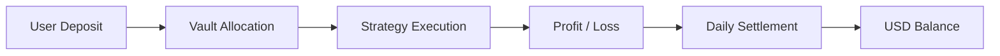

## Overview

Yield is generated through strategy execution and distributed proportionally
to users based on their Vault participation.

- Yield is not fixed and varies over time  
- Distribution is based on Vault performance  
- Allocation is proportional to user share  

---

## Yield Flow

---

## How Yield is Generated

Yield is produced through a combination of:

- Market opportunities  
- Strategy execution efficiency  
- Liquidity provisioning  
- Structured financial strategies  

Returns depend on both market conditions and execution performance.

---

## Daily Distribution Mechanism

Yield is distributed through a daily settlement process.

- Performance is calculated periodically  
- Profits are allocated to each Vault  
- Users receive yield based on their unit share  

---

## Unit-Based Allocation

Each user holds Vault units that represent their share.

- Yield is distributed proportionally  
- Higher unit holdings result in higher allocation  
- Unit accounting ensures fair distribution  

---

## USD Balance

Distributed yield is reflected in the user’s USD balance.

- Accumulates over time  
- Includes profit, rewards, and settlement amounts  
- Available for withdrawal subject to conditions  

---

## Important Considerations

- Yield is not guaranteed  
- Returns may fluctuate significantly  
- Negative performance may occur  
- Market conditions directly impact results  

---

## Transparency Model

RondSync is designed with transparency in mind.

- Daily settlement tracking  
- Clear allocation logic  
- Strategy-linked performance  

---

## Summary

Yield in RondSync is generated through:

- Strategy-driven execution  
- Market-dependent opportunities  
- Proportional distribution via Vault units  

Users participate in yield generation based on their allocated capital
and Vault selection.