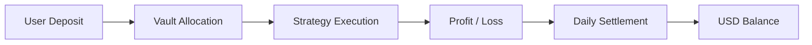

## Overview

Yield is generated through strategy execution and distributed proportionally
to users based on their Vault participation.

- Yield is not fixed and varies over time  
- Distribution is based on Vault performance  
- Allocation is proportional to user share  

---

## Yield Flow

---

## How Yield is Generated

Yield is produced through a combination of:

- Market opportunities  
- Strategy execution efficiency  
- Liquidity provisioning  
- Structured financial strategies  

Returns depend on both market conditions and execution performance.

---

## Daily Distribution Mechanism

Yield is distributed through a daily settlement process.

- Performance is calculated periodically  
- Profits are allocated to each Vault  
- Users receive yield based on their share share  

---

## Share-Based Allocation

Each user holds Vault shares that represent their share.

- Yield is distributed proportionally  
- Higher share holdings result in higher allocation  
- Share accounting ensures fair distribution  

---

## Example: Share-Based Allocation

RondoSync uses a share-based accounting system.

### Core Principle

- Vault performance is aggregated  
- Total profit is distributed across all shares  
- Each user receives yield proportional to their share ownership  

---

### Example Scenario

**Initial state:**

| Item | Value |
|---|---|
| Total Vault Assets | 100,000 USDT |
| Total Shares Issued | 100,000 shares |
| Share Price | 1.0000 USDT |

**User deposit:**

- User deposits 1,000 USDT  
- Receives 1,000 shares  

---

### Profit Generation

Assume the Vault generates:

- Total Profit: 10,000 USDT  

**New state:**

| Item | Value |
|---|---|
| Total Assets | 110,000 USDT |
| Total Shares Issued | 100,000 shares |
| New Share Price | 1.1000 USDT |

---

### User Outcome

User holds:

- 1,000 shares  

Value:

- 1,000 shares ÁE1.1000 USDT = 1,100 USDT  

👉 **Profit = 100 USDT**

---

### Key Understanding

<Info>
- Profit is NOT distributed as fixed payouts  
- It is reflected through **share price increase**  
- Each share represents a proportional claim on total assets  
</Info>

---

### Important Note

Share price may:

- Increase (profit)  
- Decrease (loss)  

Returns depend entirely on Vault performance.

---

## USD Balance

Distributed yield is reflected in the user’s USD balance.

- Accumulates over time  
- Includes profit, profits, and settlement amounts  
- Available for withdrawal subject to conditions  

---

## Important Considerations

- Yield is not guaranteed  
- Returns may fluctuate significantly  
- Negative performance may occur  
- Market conditions directly impact results  

---

## Transparency Model

RondoSync is designed with transparency in mind.

- Daily settlement tracking  
- Clear allocation logic  
- Strategy-linked performance  

---

## Summary

Yield in RondoSync is generated through:

- Strategy-driven execution  
- Market-dependent opportunities  
- Proportional distribution via Vault shares  

Users participate in yield generation based on their allocated capital
and Vault selection.
