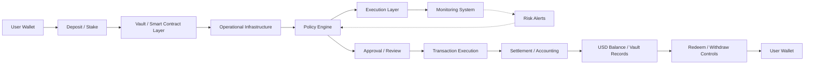

## Overview

Security in RondoSync is implemented across multiple layers.

These layers may include:

- Wallet infrastructure
- Smart contract interaction controls
- Transaction policy enforcement
- Operational wallet controls
- Monitoring and anomaly detection
- Address and activity screening
- Approval workflows
- Compliance and risk review
- Operational safeguards

RondoSync is designed to reduce operational, technical, and security risks through structured controls.

However, no system is risk-free. Security controls do not guarantee profit, capital preservation, uninterrupted access, or complete protection from loss.

<Info>
Security controls may affect platform activity, including Deposit, Redeem, Withdraw, transaction routing, account access, and other platform functions.
</Info>

---

## Security Architecture

The following diagram provides a simplified view of RondoSync’s security architecture. Actual flows may differ depending on the Vault, network, transaction type, and operational setup.

Security and policy controls may apply at different points in the lifecycle, including before, during, and after transaction execution.

---

## Wallet-Based Access

RondoSync uses wallet-based access.

Users may connect a self-custodied wallet to interact with the platform.

Wallet-based access may involve:

- Wallet connection
- Wallet address recognition
- Cryptographic signatures
- On-chain transaction approvals
- Smart contract interactions
- User confirmation of transaction details

Users are responsible for securing their own wallets, private keys, seed phrases, devices, and transaction approvals.

RondoSync cannot recover assets lost due to compromised wallets, incorrect transactions, phishing, malicious links, wrong network selection, or user error.

---

## Wallet Infrastructure

Operational wallet infrastructure may be used to support controlled fund routing, transaction execution, and platform operations.

Security measures may include:

- Controlled signing environments
- Restricted access to signing infrastructure
- Policy-based transaction controls
- Role-based access control
- Whitelisted destination addresses
- Transaction limits
- Approval workflows
- Monitoring and alerting
- Separation between application logic and signing controls

Private keys used for operational infrastructure should not be exposed to ordinary application layers.

<Info>
Operational wallet infrastructure is designed to support platform operations and transaction controls. It does not remove user responsibility for securing their own connected wallet.
</Info>

---

## Smart Contract Interaction

Certain platform interactions may involve smart contracts.

Smart contract-related controls may include:

- Standardized interaction patterns
- Controlled contract deployment processes
- Review of contract addresses and supported networks
- Separation between user-facing flows and operational logic
- Monitoring of on-chain activity
- Verification of transaction status where applicable

Users should always verify transaction details before signing.

Smart contract interactions involve risk, including code vulnerabilities, unexpected behavior, integration failures, and irreversible transactions.

---

## Transaction Control

Transactions may be subject to multiple control mechanisms.

These may include:

- Destination address validation
- Whitelisted destination addresses
- Transaction amount limits
- Network support validation
- Asset support validation
- Policy-based approval flows
- Multi-step validation processes
- Risk-based restrictions
- Compliance checks where applicable
- Operational review for certain transactions

Controls may apply to Deposit, Redeem, Withdraw, routing, settlement, and other platform activity.

---

## Policy Engine

A policy engine may govern transaction behavior across the platform.

The policy engine may be used to:

- Define allowed transaction rules
- Enforce destination restrictions
- Apply transaction amount limits
- Require approval for certain actions
- Prevent unauthorized or abnormal fund movement
- Trigger review for high-risk activity
- Restrict transactions that do not satisfy policy requirements

Policy rules may change over time based on operational, security, compliance, or risk requirements.

---

## Deposit Security

Deposit activity may involve wallet signatures and on-chain interactions.

Deposit-related security considerations may include:

- Users must verify asset, network, amount, and contract interaction
- Token approval may be required
- Smart contract risks may apply
- Wrong network selection may result in loss
- Deposits may be subject to Vault-specific rules
- Deposits may be monitored for suspicious or abnormal behavior
- Deposits may be delayed or reviewed where required by platform controls

Deposit into a Vault does not mean funds are immediately available for Withdraw. Deposited assets become part of the selected Vault position.

---

## Redeem Security

Redeem refers to exiting a Vault position according to Vault rules.

Redeem-related controls may include:

- Vault eligibility checks
- Lock-up or holding period checks
- Share and position validation
- Share Price or valuation checks
- Fee or penalty calculation
- Liquidity checks
- Settlement review
- Security review
- Compliance review where applicable
- Operational approval where required

Redeem may be delayed, restricted, or rejected if controls are triggered or Vault rules are not satisfied.

Redeem is separate from Withdraw.

---

## Withdraw Security

Withdraw refers to transferring available **USD Balance** from the platform to a connected wallet.

Withdraw-related controls may include:

- Available balance checks
- Wallet address validation
- Network validation
- Supported asset validation
- Transaction limits
- Policy enforcement
- Approval workflows
- Security checks
- Compliance review
- Risk-based restrictions
- Monitoring and confirmation of on-chain execution

Withdraw requests may be delayed, restricted, rejected, or require additional review.

Active Vault **Shares** cannot be withdrawn directly.

---

## Monitoring and Detection

RondoSync may monitor platform, wallet, and transaction activity.

Monitoring may include:

- Real-time or periodic transaction tracking
- Wallet activity monitoring
- Deposit monitoring
- Redeem monitoring
- Withdraw monitoring
- Operational wallet monitoring
- Smart contract activity monitoring
- Anomaly detection
- Suspicious activity alerts
- System health monitoring
- Infrastructure availability monitoring

Monitoring may be automated, manual, or a combination of both.

---

## Address and Activity Screening

RondoSync may screen wallet addresses and transaction activity for risk indicators.

Screening may include:

- Suspicious wallet activity
- Sanctions exposure
- Fraud indicators
- Scam or phishing-related activity
- Stolen funds exposure
- High-risk counterparties
- High-risk jurisdictions
- Abnormal transaction patterns
- Links to prohibited or suspicious activity

Screening may use internal systems, third-party tools, blockchain analytics providers, compliance service providers, or other risk intelligence sources.

<Info>
A wallet, account, transaction, Redeem request, or Withdraw request may be restricted or reviewed if risk indicators are detected.
</Info>

---

## Approval Workflows

Certain actions may require automated or manual approval.

Approval may be required for:

- High-value transactions
- Withdraw requests
- Redeem requests
- Transactions to new or flagged addresses
- Abnormal activity
- Policy exceptions
- Compliance-triggered activity
- Operational exceptions

Approval workflows are designed to reduce unauthorized or high-risk activity, but they may also cause delays.

---

## Compliance and Risk Review

RondoSync may apply compliance and risk review where necessary.

Compliance or risk review may be triggered by:

- Suspicious activity
- Wallet screening results
- Sanctions exposure
- Fraud indicators
- Large or abnormal transactions
- Repeated failed validations
- Inconsistent information
- High-risk jurisdictions
- Service provider alerts
- Legal or regulatory requirements
- Platform policy requirements

During review, RondoSync may delay, restrict, reject, suspend, or require additional verification for certain activity.

This may affect Deposit, Redeem, Withdraw, account access, or other platform functions.

---

## Operational Security

Operational procedures are designed to reduce human and system risk.

Operational safeguards may include:

- Controlled approval processes
- Role-based access management
- Internal review procedures
- Transaction verification
- Exception handling
- Segregation of duties where applicable
- Monitoring and alert escalation
- Incident response procedures
- Internal audit or reconciliation processes

Operational controls may evolve over time as the platform develops.

---

## Infrastructure Reliability

RondoSync may rely on multiple infrastructure components.

These may include:

- Blockchain networks
- RPC providers
- Smart contracts
- Backend systems
- Databases
- Wallet infrastructure providers
- Monitoring systems
- Security tools
- Compliance and analytics providers
- Third-party execution venues

Infrastructure risks may include outages, latency, incorrect data, delayed execution, API failures, network congestion, or third-party service disruption.

RondoSync may implement redundancy, monitoring, and operational procedures, but uninterrupted service is not guaranteed.

---

## Data and Accounting Integrity

RondoSync may maintain internal accounting records for Vault participation and app balances.

These records may include:

- Vault positions
- **Shares**
- **Share Price**
- Rewards records
- **USD Balance**
- Redeemed amounts
- Withdraw request status
- Transaction status
- Settlement or valuation records

Controls may be used to support data integrity, including reconciliation, validation, monitoring, and review.

However, data errors, delays, incorrect calculations, or infrastructure issues may occur.

---

## Incident Response

RondoSync may take protective actions in response to security, operational, or compliance incidents.

Protective actions may include:

- Temporarily pausing certain functions
- Delaying transactions
- Restricting Withdraw
- Restricting Redeem
- Blocking suspicious addresses
- Requiring additional verification
- Reviewing affected accounts or transactions
- Updating policy rules
- Coordinating with service providers
- Reporting where legally required or appropriate

Protective actions may be taken without prior notice where necessary to protect users, the platform, or comply with legal obligations.

---

## User Responsibility

Security is a shared responsibility.

Users are responsible for:

- Protecting wallet private keys and seed phrases
- Using secure devices and browsers
- Avoiding phishing websites and malicious links
- Verifying the correct website URL
- Confirming transaction details before signing
- Selecting the correct network and asset
- Reviewing contract interactions and token approvals
- Securing connected accounts and devices
- Understanding that blockchain transactions may be irreversible

Users should not share private keys, seed phrases, or sensitive wallet information with anyone.

---

## Limitations

Despite security measures, risks remain.

Security controls cannot eliminate all risks, including:

- Smart contract vulnerabilities
- Blockchain network failures
- Wallet compromise
- User error
- Phishing or social engineering
- Third-party platform failure
- Infrastructure outages
- Data or accounting errors
- Operational mistakes
- Security incidents
- Regulatory or compliance restrictions

Security design reduces risk but does not guarantee safety, profitability, or uninterrupted access.

---

## Relationship to Risk and Legal Documents

Security controls should be understood together with the Risk and Legal sections.

Users should review:

- [Risk Overview](/security/risk)
- [Risk Disclosure](/legal/risk)
- [Terms of Use](/legal/terms)
- [KYC / AML Policy](/legal/kyc-aml)
- [Privacy Policy](/legal/privacy)

These documents provide additional information about risks, restrictions, compliance review, user responsibilities, and platform limitations.

---

## Summary

RondoSync security is based on a multi-layered model that may include:

- Wallet-based access
- Smart contract interaction controls
- Operational wallet infrastructure
- Policy-based transaction controls
- Monitoring and anomaly detection
- Address and activity screening
- Approval workflows
- Compliance and risk review
- Operational safeguards
- Incident response procedures

These controls are designed to reduce risk and support structured platform operations.

However, no security model can eliminate all risks. Users must understand the risks, secure their own wallets, and review all applicable documentation before using RondoSync.