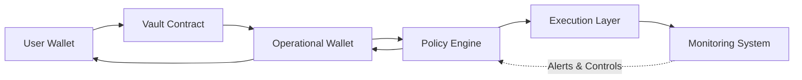

## Overview

Security in RondSync is implemented across multiple layers:

- Wallet infrastructure  
- Transaction control  
- System monitoring  
- Operational safeguards  

No system is risk-free, but RondSync aims to reduce risk
through structured design and controls.

---

## Security Architecture

All capital movement — both inbound and outbound — passes through the Policy Engine.
The Monitoring System operates continuously and feeds control signals back into the Policy Engine.

---

## Wallet Infrastructure

Operational wallets are managed using secure infrastructure.

- Private keys are not exposed to application layers  
- Secure signing environments are used  
- Access is restricted through policy-based controls  

---

## Transaction Control

All transactions are subject to strict control mechanisms.

- Whitelisted destination addresses  
- Transaction amount limits  
- Policy-based approval flows  
- Multi-step validation processes  

---

## Policy Engine

A policy engine governs transaction behavior.

- Defines allowed transaction rules  
- Enforces security constraints  
- Prevents unauthorized fund movement  

---

## Monitoring and Detection

Continuous monitoring is applied to system activity.

- Real-time transaction tracking  
- Anomaly detection systems  
- Suspicious activity alerts  

---

## Operational Security

Operational procedures reduce human and system risk.

- Controlled approval processes  
- Role-based access management  
- Internal audit and verification  

---

## Smart Contract Interaction

On-chain interactions are designed with safety in mind.

- Standardized contract interaction patterns  
- Controlled deployment and upgrades  
- Separation between user-facing and operational logic  

---

## Infrastructure Reliability

RondSync relies on distributed infrastructure components.

- Redundant systems and failover mechanisms  
- Reliable network connectivity  
- Scalable architecture  

---

## User Responsibility

Security is a shared responsibility.

Users must:

- Protect their wallet private keys  
- Verify transaction details before signing  
- Avoid phishing and malicious links  

---

## Limitations

Despite security measures, risks remain.

- Smart contract vulnerabilities  
- Infrastructure failures  
- External platform risks  

---

## Summary

RondSync security is based on:

- Layered architecture  
- Policy-controlled transactions  
- Continuous monitoring  

The system is designed to minimize risk,
but users must remain aware of potential threats.